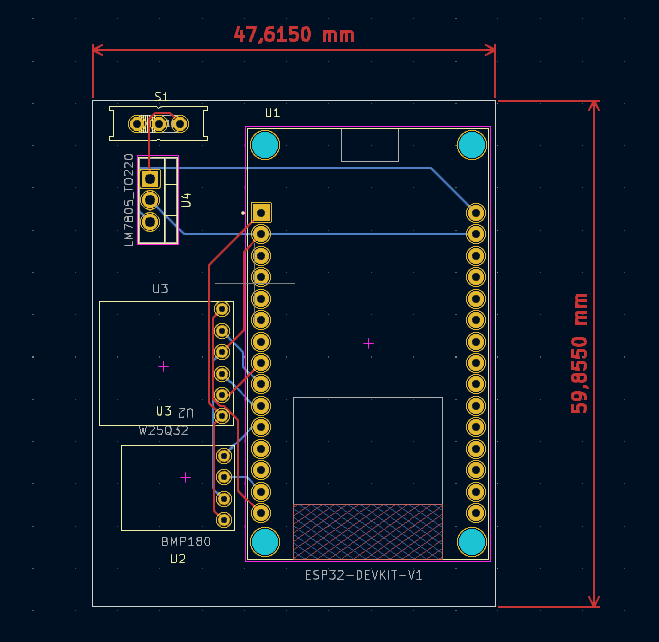
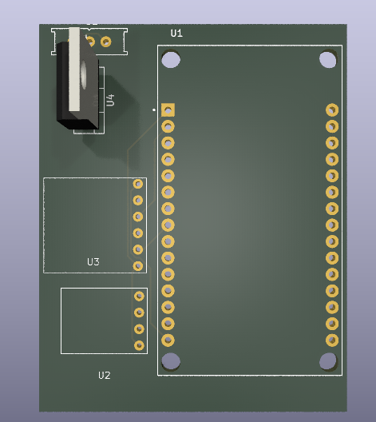
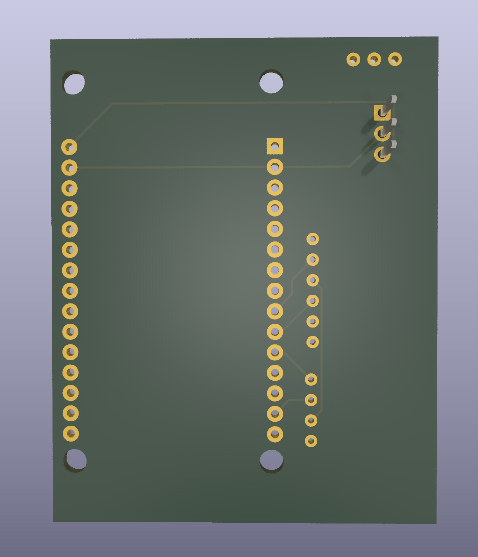
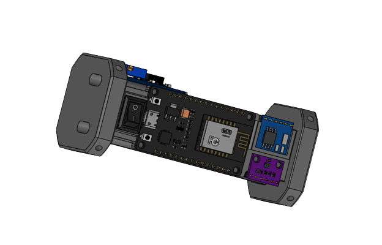

# AltPRD
Desenvolvimento do projeto de Altímetro PRD v0 

Acabou que virou um outro produto completamente completo kk

## Como estava:

Esquemático do circuito:

Visão geral do layout PCB:

Visão 3D superior:

Visão 3D inferior:

Como ficou:

